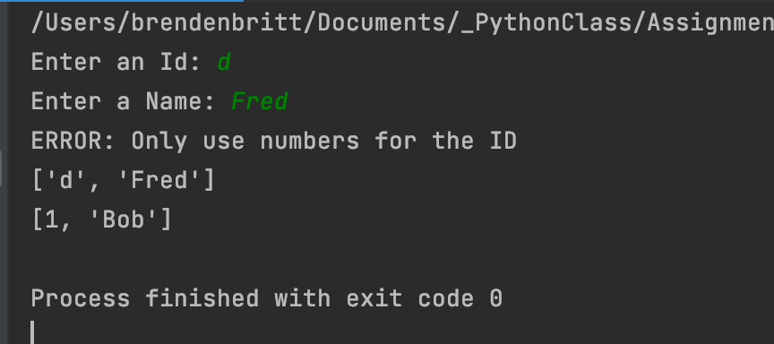
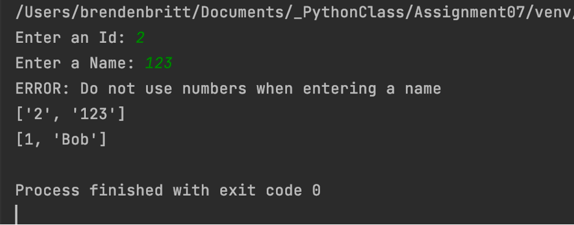

# Working with the Pickle and Exception Handling features
**BBritt**  
*5.25.2021*

## Introduction
### In this write-up, I will be discussing how I created a Python Script that demonstrates the use of pickling and error exception handling. I researched online for websites that provide good explanations and examples of how to do both of these Python features. The script in this assignment uses pickling and exception handling, among other things learned in previous assignments, to create a working program that solves this task.

## Learning Pickling
### An important part of this assignment was learning what pickling is. Pickling is a technique used in python to save and store data in binary format. This allows for the reduction of the file’s size because it obscures the data. Pickling is done by attaching a ‘b’ to the w, r, or a types when working with a file. Additionally, pickle.dump and pickle.load are used when writing to a file or loading data from a binary file.

```
# ---------------------------------------------------------------------------- #
# Title: Assignment 07
# Description: Researching and working with the Pickle and Exception Handling features
# ChangeLog (Who,When,What):
# BBritt,5.23.2021,Modified code to complete assignment 7
# BBritt,5.24.2021,Modified code to complete assignment 7
# BBritt,5.24.2021,Added comments and edited script
# ---------------------------------------------------------------------------- #

import pickle   #Import existing binary file

userID = ()
useName = ()
lstData = []

try:
    userID = input("Enter an Id: ")  # user input ID
    userName = str(input("Enter a Name: "))  # user input Name
    lstData = [userID, userName]  # list of ID and Name
    if not userID.isnumeric():
        raise Exception('ERROR: Only use numbers for the ID') #error if user enters a letter for ID
    elif userName.isnumeric():
        raise Exception('ERROR: Do not use numbers when entering a name') #error if user enters number for name
except Exception as e:
    print(e)

print(lstData)

objFile = open("AppData.dat", "ab")     #adding user input to existing binary file
pickle.dump(lstData, objFile)
objFile.close()

objFile = open("AppData.dat", "rb")     #reads binary file contents
objFileData = pickle.load(objFile)     #load() only loads one row of data.
objFile.close()
print(objFileData)
```

  
Figure 1. The results of my script


  
Figure 2. The results of my script

