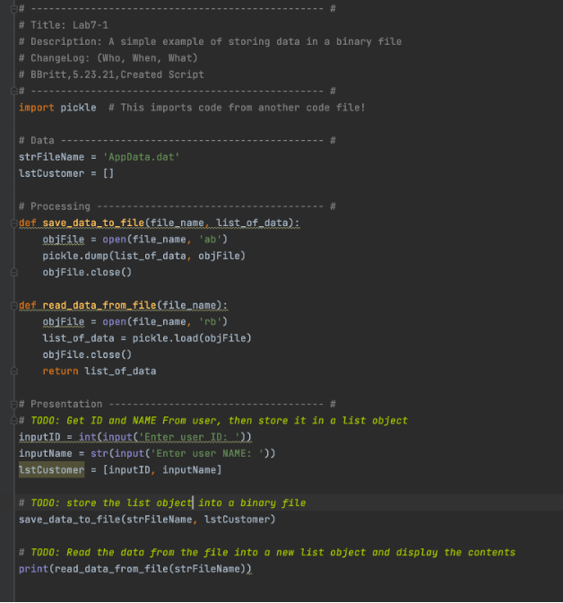

# Working with the Pickle and Exception Handling features
**BBritt**  
*5.25.2021*

## Introduction
### In this write-up, I will be discussing how I created a Python Script that demonstrates the use of pickling and error exception handling. I researched online for websites that provide good explanations and examples of how to do both of these Python features. The script in this assignment uses pickling and exception handling, among other things learned in previous assignments, to create a working program that solves this task.


## Learning Pickling
### An important part of this assignment was learning what pickling is. Pickling is a technique used in python to save and store data in binary format. This allows for the reduction of the file’s size because it obscures the data. Pickling is done by attaching a ‘b’ to the w, r, or a types when working with a file. Additionally, pickle.dump and pickle.load are used when writing to a file or loading data from a binary file.


  
Figure 1. Learning Pickling. LAB 1-1
### Figure 1 shows the script I created to learn what pickling is. In this script, I used a ‘b’ attached to the a and r to signal working with a binary file. I used the pickle.dump to dump data into the binary file. I also used pickle.load to load the data in the binary file and return it in a readable format.


## Learning error exception handling
### Another valuable thing to know in Python is how to use error exception handling. This is important because using this feature of Python can help clarify to users any errors they may encounter when running the code. Additionally, exception handling can be used to guide the user in a specific direction by raising an exception if an un-wanted input in entered. Exception handling uses Try and Except blocks, as well as Raise, to identify specific errors the user might make, and to print an error message if the user does make them.


## Researching and working with pickling and exception handling features
### For this assignment, I googled information about pickling and exception handling to learn what they are and how they are used. The two sites I found about pickling are: https://docs.python.org/3/library/pickle.html#:~:text=%E2%80%9CPickling%E2%80%9D%20is%20the%20process%20whereby,back%20into%20an%20object%20hierarchy and https://www.geeksforgeeks.org/understanding-python-pickling-example/. These two sites helped in my understanding of what pickling is used for, and they also provided many helpful examples of pickling being used in a script. The two sites I used for exception handling are https://docs.python.org/3/tutorial/errors.html and https://www.w3schools.com/python/python_try_except.asp. Both of these sites are good for learning how to use Try, Except, and Raise blocks in a script. Good examples are provided on both sites. In my script, I created a simple command that imports an existing binary file using import pickle. I then take user unput for two variables inside a try block, and raise an exception if a letter is entered in the ID input or if a number is entered in the name input. I close the loop by using the except block to print the exception if the code detects the specific user input. I then add to the binary file and read it using the ‘ab’ and ‘rb’ options. I use pickle.dump with ‘ab’ to write to the file, and pickle.load with ‘rb’ to read the contents of the file. This is shown in the images below.

```
# ---------------------------------------------------------------------------- #
# Title: Assignment 07
# Description: Researching and working with the Pickle and Exception Handling features
# ChangeLog (Who,When,What):
# BBritt,5.23.2021,Modified code to complete assignment 7
# BBritt,5.24.2021,Modified code to complete assignment 7
# BBritt,5.24.2021,Added comments and edited script
# ---------------------------------------------------------------------------- #

import pickle   #Import existing binary file

userID = ()
useName = ()
lstData = []

try:
    userID = input("Enter an Id: ")  # user input ID
    userName = str(input("Enter a Name: "))  # user input Name
    lstData = [userID, userName]  # list of ID and Name
    if not userID.isnumeric():
        raise Exception('ERROR: Only use numbers for the ID') #error if user enters a letter for ID
    elif userName.isnumeric():
        raise Exception('ERROR: Do not use numbers when entering a name') #error if user enters number for name
except Exception as e:
    print(e)

print(lstData)

objFile = open("AppData.dat", "ab")     #adding user input to existing binary file
pickle.dump(lstData, objFile)
objFile.close()

objFile = open("AppData.dat", "rb")     #reads binary file contents
objFileData = pickle.load(objFile)     #load() only loads one row of data.
objFile.close()
print(objFileData)
```
Figure 2. Code for this assignment


  
Figure 3. Successfully running my script


  
Figure 3. Successfully running my script


  
Figure 5. Testing my code in the terminal


### Figures 1, 2, 3, 4, and 5 show my code take user input data to interact with the menu and work with an existing script. These images show the code running in PyCharm and the terminal, and the script working.


## Summary
### This assignment was pretty easy as the script was short. The part that was different was having to research our own information about pickling and exception handling. The notes provided by Professor Root also gave good examples of how to use both these features. I was able to complete a working script using the new information I found, as well as information learned in previous assignments.


